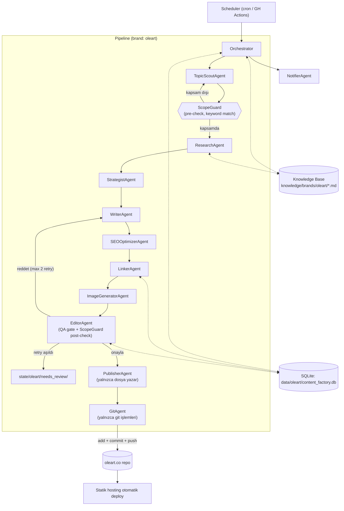
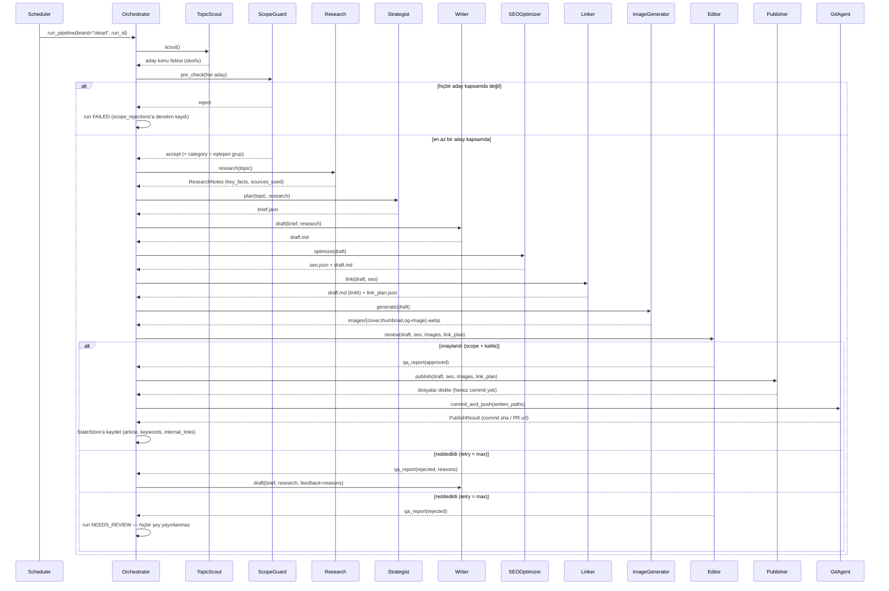

# Content Factory — Sistem Mimarisi (v2)

**v1 → v2 değişikliği:** Bu doküman, sistemin yalnızca Oleart için değil, **çoklu marka**
altyapısı olarak çalışacak şekilde revize edilmiş mimarisini tanımlar. Kod bu iterasyonda da
yazılmadı — bu saf bir mimari revizyon dokümanıdır. Faz planı için `ROADMAP.md`'ye bakın.

**Kapsam (v2):** Marka bilgisi ve içerik kapsamı tamamen konfigürasyon + knowledge base
üzerinden yönetilen, blog/SEO makaleleri üreten, görsellerini AI ile oluşturan, güçlü iç
linkleme yapan ve insan onayı beklemeden yayınlayan otonom içerik hattı.

**Kapsam dışı (v2):** sosyal medya, ürün açıklaması, newsletter — bkz. `ROADMAP.md` Faz 4.

---

## 0. Tasarım İlkeleri

Bu revizyonun dayandığı beş temel karar:

1. **Kapsam bir prompt talimatı değil, bir mimari bileşendir.** `ScopeGuard`, LLM'in "unutup
   konu dışına çıkma" riskine karşı iki bağımsız, deterministik+yarı-deterministik geçit olarak
   var olur (bkz. §2).
2. **Marka bilgisi asla kodda veya prompt string'lerinde yaşamaz.** Yapılandırılmış/ölçülebilir
   kurallar (`brand.yaml`) ile anlatısal bilgi (`knowledge/*.md`) ayrıştırılır (bkz. §3).
3. **İçerik üretimi ile yayın altyapısı ayrı sorumluluklardır.** Publisher dosya yazar,
   GitAgent versiyon kontrolü yapar. Biri değişirse diğeri etkilenmez (bkz. §8).
4. **Hiçbir agent bir LLM sağlayıcısına sabitlenmez.** Tüm çağrılar `BaseLLMProvider`
   arayüzü üzerinden yapılır; sağlayıcı/model seçimi tamamen config'tedir (bkz. §9).
5. **Sistem gün 1'den çoklu marka varsayımıyla tasarlanır.** Oleart, `brands/oleart/` altında
   yaşayan *bir örnektir* — ikinci bir marka eklemek çekirdek koda dokunmadan yapılabilmelidir
   (bkz. §10).

---

## 1. Yüksek Seviye Mimari



Editor reddettiğinde Orchestrator yalnızca **taslak döngüsünü** (Writer → SEO → Linker)
tekrarlar; görsel yeniden üretilmez (görsel makalenin konusuna bağlıdır, metnine değil).
Kalıcı kayıtlar (`articles`, `keywords`, `internal_links`) **yalnızca GitAgent başarılı
olduktan sonra** yazılır — yayınlanmamış bir makale StateStore'u kirletmemelidir.

Tasarım ilkesi (değişmedi): agent'lar birbirini doğrudan çağırmaz, yalnızca **Orchestrator**
üzerinden ve ortak **pipeline state** nesnesi üzerinden konuşur.

**Yeni bileşenler:** `ScopeGuard` (guard, agent değil), `LinkerAgent`, `GitAgent`.
**Kaldırılan:** Publisher'ın git sorumluluğu, HTML template üretimi.

---

## 2. İçerik Kapsamı Garantisi — ScopeGuard

En kritik gereksinim: sistem **yalnızca** `brands/{brand}/scope.yaml`'da tanımlı konularda
içerik üretebilmeli. Bu, tek bir prompt cümlesiyle değil, iki bağımsız geçitle garanti altına
alınır (`src/content_factory/guards/scope_guard.py`):

| Katman | Ne zaman | Yöntem | Neden yeterli |
|---|---|---|---|
| **Pre-check** | TopicScout çıktısından hemen sonra, Strategist'e ulaşmadan önce | Deterministik anahtar kelime eşleştirmesi: aday konu, `scope.yaml groups[].topics` ile örtüşmüyorsa **hiçbir LLM çağrısı yapılmadan** reddedilir | Ucuz, hızlı, LLM'in "yaratıcı" sapmasına karşı bağışıklı |
| **Post-check** | Editor QA gate'inin bir parçası olarak, final draft üzerinde | LLM sınıflandırıcı: draft'ı `scope.yaml groups[].id` veya `"out_of_scope"` olarak etiketler; `out_of_scope_examples` few-shot negatif örnek olarak verilir | Writer'ın konudan sapması (ör. genel sağlık tavsiyesine kayması) yalnızca içerik okunarak yakalanabilir — bu yüzden semantik kontrol şart |

Her iki katman da reddederse **aynı editor retry mekanizmasına** girer (`max_retries` aşılırsa
`state/{brand}/needs_review/`). Tüm reddedilenler `scope_rejections` tablosuna (SQLite, bkz.
§7) loglanır — bu hem denetim (audit) hem de zamanla `scope.yaml`'ı iyileştirmek için veri
sağlar.

`ScopeGuard` marka-parametrik bir bileşendir: `scope.yaml`'ı hangi markanın çağırdığına göre
okur, kod içinde "oleart" veya "zeytin" gibi hiçbir sabit değer bulunmaz.

### 2.1 Konu Tekrarı — NoveltyGuard

Kapsamın ikizi olan sorun: makale kapsam İÇİNDE ama **zaten yazılmış** bir konunun farklı
kelimelerle tekrarı. Aynı gerekçeyle (bkz. §1) bu da bir prompt talimatına bırakılmaz —
TopicScout'un prompt'unda "tekrar etme" yazmasına rağmen model üç ardışık run'da aynı konuyu
önerdi ("Erken Hasat Zeytinyağı ile Yemek Pişirmenin Faydaları" → "... Yemeklerde Nasıl
Kullanılır"). StateStore'un tekrar kontrolü **birebir** anahtar kelime eşleşmesi olduğu için
bunlar filtreden geçiyordu.

`NoveltyGuard` (bkz. `guards/novelty_guard.py`) yayınlanmış başlıklarla aday başlığı kelime
köklerine indirgeyip kapsama oranıyla karşılaştırır; Orchestrator eşiği aşan adayları eler.
Ayrıca seçim, **en son yayınlanandan farklı kategoriye** öncelik verir — aksi halde blog tek
bir ürün eksenine (hep zeytinyağı) kayıyor ve markanın ahşap ürün tarafı hiç yazılmıyordu.

### 2.2 Konu Havuzu — topics_backlog

TopicScout her run'da 5 aday üretip 1'ini kullanıyor, kalan 4'ü çöpe gidiyordu; ertesi run
aynı LLM çağrısı baştan yapılıyordu. Artık seçilmeyen **uygun** adaylar (kapsam onaylı +
tekrar olmayan) `topics_backlog` tablosuna yazılır ve **backlog doluysa TopicScout hiç
çağrılmaz** — bir LLM çağrısı tasarrufu ve daha az kota tüketimi.

Backlog kayıtları bayatlayabilir: bir konu kaydedildikten sonra ona benzer bir makale
yayınlanmış veya `scope.yaml` daralmış olabilir. Bu yüzden bekleyen konular kullanılmadan
önce aynı deterministik süzgeçlerden (ScopeGuard pre-check + NoveltyGuard) **yeniden**
geçirilir; elenenler `stale` işaretlenir ki her run'da tekrar değerlendirilmesinler. Hepsi
bayatsa TopicScout'a düşülür — bayat bir konuyu zorla kullanmak yerine yeni aday üretmek
doğru davranıştır. Backlog yalnızca TopicScout'un çalıştığı run'larda büyüdüğü için
sınırsız birikme olmaz.

---

## 3. Knowledge Base

Marka bilgisi **kod içinde veya prompt string'lerinde bulunmaz**. İki ayrı katmanda yaşar
(detaylı kullanım/onboarding için bkz. `knowledge/README.md`):

- **Yapılandırılmış/deterministik kurallar** → `brands/{brand}/*.yaml` (kelime sayısı
  sınırları, yasaklı kelimeler/iddialar, kapsam allowlist'i — kod ile doğrulanabilir olmalı).
- **Anlatısal/bağlamsal bilgi** → `knowledge/brands/{brand}/*.md` (LLM'e "okuma metni"
  olarak verilir, kod tarafından parse edilmez). Bu, marka config'inden (`brands/`)
  kasıtlı olarak ayrı bir üst dizindir — Knowledge Base kendi başına bir alt sistemdir.

```
knowledge/brands/oleart/
├── brand.md              # marka kimliği: kim, misyon, vizyon, değerler
├── products.md            # satılan tüm ürün kategorileri
├── olive_oil.md            # zeytinyağı hakkında doğrulanmış bilgi tabanı
├── olive_tree.md            # zeytin ağacı hakkında bilgi tabanı
├── kitchen_products.md       # zeytin ağacından üretilen mutfak ürünleri
├── faq.md                     # SSS — SEOOptimizerAgent FAQ schema için de kullanır
├── writing_rules.md            # yazım standartları
├── seo_rules.md                  # blog SEO standartları
├── content_scope.md               # içerik kapsamı — kanonik kaynak: brands/oleart/scope.yaml
├── internal_linking.md             # iç link kuralları
├── legal_rules.md                    # yasal/regülasyon kuralları
├── forbidden_claims.md                # yasaklı ifadeler — kanonik kaynak: brands/oleart/brand.yaml
├── target_audience.md                  # hedef müşteri profilleri
├── tone.md                               # marka sesi
├── style_guide.md                         # biçimsel/stilistik tercihler
└── sources.md                               # güvenilir kaynak politikası
```

**Kanonik kaynak kuralı:** `content_scope.md` ↔ `scope.yaml` ve `forbidden_claims.md` ↔
`brand.yaml` aynı bilgiyi iki farklı okuyucu için (kod vs. LLM) yeniden ifade eder.
YAML her zaman enforcement'ın kanonik kaynağıdır; `.md` dosyaları ondan **sapamaz** —
bu, `tests/test_knowledge.py`'deki drift-guard testleriyle otomatik doğrulanır.

`KnowledgeLoader` (`src/content_factory/knowledge/loader.py`) bir markanın 16 dosyasını
ilk erişimde okuyup bellekte cache'ler (`invalidate()` ile temizlenebilir) ve tip güvenli
bir `BrandKnowledge` nesnesi döndürür (`kb.get_tone()`, `kb.get_content_scope()`, ...).
Agent'lar dosya adı bilmez; yalnızca `AgentContext.knowledge` üzerinden bu nesneye erişir.
`KnowledgeLoader.validate(brand)` eksik/boş/doldurulmamış (placeholder) dosyaları raporlar.

16 dosyanın tamamı gerçek içerikle dolduruldu (marka bilgisi oleart.co'dan, teknik/faktüel
bilgi TGK/IOC gibi otoritelerden). Marka sahibince teyit edilmesi gereken bilgiler
(hasat bölgesi, çeşit, ahşap ürün detayları) **uydurulmadı**; ilgili dosyalarda
"Doğrulanması Gereken" başlığı altında açık kısıt olarak duruyor — WriterAgent bu
konularda marka-spesifik iddia yazamaz. `tests/test_knowledge.py` hem placeholder
regresyonunu hem de `scope.yaml`/`brand.yaml` ile tutarlılığı doğrular.

---

## 4. Agent'lar

| # | Agent | Sorumluluk | Girdi | Çıktı |
|---|-------|-----------|-------|-------|
| 1 | **TopicScoutAgent** | SEO/trend araştırması yapar, SQLite `topics_backlog`/`keywords` tablolarına karşı kontrol ederek tekrarsız aday konular üretir | brand.md, products.md, seo.yaml | `topic.json` (skorlu aday listesi) |
| — | **ScopeGuard (pre)** | Aday konuyu `scope.yaml`'a karşı deterministik doğrular; eşleşen grup konunun `category`'sini kesinleştirir | topic.json | kabul / red (LLM çağrısı yok) |
| 2 | **ResearchAgent** | Seçilen konu hakkında knowledge base'e dayalı, **kaynaklı** araştırma notları çıkarır — Writer'ın faktüel dayanağı; uydurma bilgi riskini azaltır | topic, olive_oil.md/olive_tree.md/kitchen_products.md, sources.md | `ResearchNotes` (key_facts, suggested_angle, sources_used) |
| 3 | **StrategistAgent** | Konu + araştırmayı birleştirip brief yazar: başlık, hedef/ikincil kelimeler, hedef kitle, ton, uzunluk, outline | topic, ResearchNotes, target_audience.md | `brief.json` |
| 4 | **WriterAgent** | Türkçe, marka sesine uygun uzun-form taslak yazar | brief.json, ResearchNotes, tone.md, writing_rules.md, (varsa) editor geri bildirimi | `draft.md` |
| 5 | **SEOOptimizerAgent** | Meta title/description (LLM) + **deterministik slug** (`utils.text.slugify`, oleart.co'nun `build-blog.mjs`'iyle aynı kural — LLM'e sorulmaz) | draft.md, seo.yaml, faq.md | `SEOData` + slug'ı set edilmiş makale |
| 6 | **LinkerAgent** *(LLM çağırmaz)* | Eski makaleleri (SQLite `articles`) tarar, ilgili makaleleri bulur, **yeni makalenin prose'una** doğal iç linkler ekler; eski makaleleri **prose düzeyinde değil**, yapılandırılmış `related_articles` frontmatter alanı üzerinden günceller (bkz. §5) | draft.md, SQLite articles | güncellenmiş `draft.md` + `link_plan.json` |
| 7 | **ImageGeneratorAgent** | Bir adet temel görsel üretir (prompt deterministik olarak kurulur, LLM çağrılmaz); `cover/thumbnail/og-image` türevlerini Pillow ile crop+resize eder | makale başlığı/kategorisi, brand.md | `images/{cover,thumbnail,og_image}.webp` (run'a özel staging dizininde) |
| 8 | **EditorAgent** *(zorunlu geçit)* | Üç katman, ucuzdan pahalıya: (1) deterministik — yasaklı kelime/iddia, `content_bounds` kelime sayısı, planlanan iç linklerin gerçekten işlendiği, sayısal iddia zeminlemesi; (2) **ScopeGuard post-check**; (3) LLM kalite incelemesi — yalnızca ilk ikisi temizse ve yalnızca ÖZNEL yargı için. Katman 3'ün her gerekçesi makaleden birebir alıntı taşımak zorundadır ve `ReviewGuard` tarafından metne karşı doğrulanır; doğrulanmayan gerekçe karara katılmaz (bkz. §15). Reddederse gerekçeleri Writer'a `feedback` olarak döner | draft.md, link_plan.json, brand.yaml | `QAReport` (decision, scope_decision, reasons, review_unavailable) |
| 9 | **PublisherAgent** | Onaylı içeriği **markdown** olarak render eder (HTML üretmez), frontmatter'ı doldurur, hedef repoya (`target_repo_path`) dosyaları yazar: yeni `.md` + görseller + `related_articles` güncellenen eski `.md` dosyaları. **Git işlemi yapmaz.** | onaylı draft, SEOData, images, link_plan.json | `content/blog/*.md`, `public/blog/images/*/*.webp` (diskte, henüz commit edilmemiş) + repo köküne göreli `written_paths` |
| 10 | **GitAgent** | `written_paths`'i `GitProvider` üzerinden `git add` → `commit` → `push` (veya PR) eder; `publish_strategy`'ye göre davranır. Kendisi subprocess çalıştırmaz | `PublisherOutput`, publish.yaml | `PublishResult` (commit sha / PR url) |
| — | **NotifierAgent** *(Faz 2)* | Çalışma özetini bildirir | run_log.json | bildirim |

**Guardrail notu (değişmedi):** "Tam otonom" = insan onayı beklemeden yayınlanır, ama kalite/
kapsam kontrolü zorunludur. Editor + ScopeGuard geçidi aşılamayan içerik asla Publisher'a
ulaşmaz.

---

## 5. LinkerAgent — Neden Prose Değil, Frontmatter?

Naif bir tasarım LinkerAgent'ın eski, zaten yayınlanmış makalelerin **gövde metnine** LLM ile
cümle enjekte etmesini önerir. Bu mimaride bilinçli olarak **reddedildi**, çünkü:

- Eski makale zaten Editor gate'inden geçmiş, onaylanmış bir metindir; onu tekrar LLM ile
  düzenlemek regresyon riski taşır (ton kayması, faktüel hata, format bozulması) — ve bu ikinci
  düzenleme Editor'den geçmez.
- Yapılandırılmış bir alan (`related_articles: [slug, slug, ...]` frontmatter listesi),
  deterministik, diff'i küçük, riski sıfıra yakın bir güncellemedir.

Bu yüzden LinkerAgent'ın çıktısı iki farklı mekanizma kullanır:

1. **Yeni makale içinde:** doğal, gövde-içi markdown linkleri (`[erken hasat nedir](...)`) —
   bu içerik zaten Editor'den geçecek taze üretimdir, risksizdir.
2. **Eski makalelerde:** yalnızca `related_articles` frontmatter alanına yeni makalenin slug'ı
   eklenir (oleart.co bunu "İlgili Yazılar" widget'ı olarak render eder). Gövde metni
   **değiştirilmez**.

`link_plan.json` şeması:
```json
{
  "new_article_body_links": [
    {"anchor": "erken hasat zeytinyağı", "target_slug": "erken-hasat-zeytinyagi-nedir"}
  ],
  "related_articles_updates": [
    {"target_slug": "zeytinyagi-nasil-saklanir", "add_related": "yeni-makale-slug"}
  ]
}
```

v1 eşleştirme yöntemi: `target_keyword` + `secondary_keywords` + `category` üzerinde basit
küme benzerliği (Jaccard/anahtar kelime örtüşmesi) — küçük korpus için yeterli, embedding
gerektirmez. Faz 3'te embedding-tabanlı benzerliğe geçiş opsiyonel bir iyileştirme olarak
roadmap'te yer alır.

---

## 6. Yayın Sözleşmesi (Publish Contract)

Publisher artık **HTML üretmez**. Çıktısı, hedef marka sitesinin (oleart.co) okuyup
render edeceği markdown + statik görsellerdir. Bu sözleşme, content-factory ile marka
sitesi arasındaki **API**'dir — her iki taraf da bu şemaya uymalı.

```
{target_repo_path}/
├── content/blog/
│   └── 2026-07-30-zeytinyagi-donar-mi.md
└── public/blog/images/
    └── zeytinyagi-donar-mi/
        ├── cover.webp
        ├── thumbnail.webp
        └── og-image.webp
```

Dosya adı: `{YYYY-MM-DD}-{slug}.md` — tarih, yayın tarihini deterministik olarak kodlar (ek DB
sorgusu gerekmeden sıralama/arşivleme mümkün olur).

Frontmatter şeması (`schema_version` ile versiyonlanır — ileride alan eklemek eski makaleleri
bozmaz):

```yaml
---
schema_version: 1
title: "Zeytinyağı Donar mı?"     # sayfa içi H1
slug: zeytinyagi-donar-mi
date: 2026-07-30
category: olive_and_oil          # scope.yaml groups[].id
target_keyword: "zeytinyağı donar mı"
secondary_keywords: ["zeytinyağı saklama", "zeytinyağı bulanıklaşması"]
description: "..."                # meta description, 150-160 karakter
cover_image: /blog/images/zeytinyagi-donar-mi/cover.webp
thumbnail_image: /blog/images/zeytinyagi-donar-mi/thumbnail.webp
og_image: /blog/images/zeytinyagi-donar-mi/og-image.webp
related_articles: [erken-hasat-zeytinyagi-nedir]
reading_time_minutes: 5
status: published
meta_title: "Zeytinyağı Donar mı? | Oleart"   # <title> etiketi için, title'dan farklı olabilir
---
```

**Boş alanlar yazılmaz:** değeri olmayan opsiyonel alanlar (ör. görsel üretilmediyse
`cover_image`) frontmatter'a `null` olarak değil, **hiç** yazılmaz — tüketici tarafın
"alan var ama değeri yok" ayrımı yapması gerekmesin diye. Publisher'ın ürettiği görsel
URL'leri `publish.yaml: images_dir` ve `public_root`'tan türetilir
(`public/blog/images` + kök `public` → `/blog/images/...`).

**Bağımlılık/blocker:** oleart.co şu an tek sayfalık statik bir site, bu sözleşmeyi okuyup
render edebilecek bir yapıya (statik site generator — Astro/Next.js/Eleventy benzeri) sahip
değil. Bu, content-factory'nin değil **oleart.co projesinin** sorumluluğudur ama Faz 0'ı
bloke eden açık bir bağımlılık olarak işaretlenmiştir (bkz. `ROADMAP.md`).

---

## 7. Görsel Pipeline

Gereksinim: her makale için `cover.webp`, `thumbnail.webp`, `og-image.webp`. Bunları 3 ayrı
üretim çağrısıyla oluşturmak yerine:

1. `ImageGeneratorAgent` **tek** bir yüksek çözünürlüklü temel görsel üretir (marka görsel
   diline uygun prompt: zeytin/zeytinyağı, doğal/sıcak tonlar).
2. `integrations/image_processing.py`, bu tek görselden `config/engine.yaml: image_derivatives`
   içindeki boyut/oran tanımlarına göre üç türevi crop+resize+webp-encode ile üretir.

**Neden:** (a) maliyet — 3 yerine 1 üretim çağrısı; (b) görsel tutarlılık — kapak, küçük resim
ve OG kartı aynı görselin türevi olduğu için marka kimliği makale içinde/dışında tutarlı kalır;
(c) yeniden kullanılabilirlik — Faz 4'teki sosyal medya modülü aynı türetilmiş varlıkları
kullanabilir (gereksinimde belirtildiği gibi).

---

## 8. Git Ayrımı — Publisher vs. GitAgent

| | Publisher | GitAgent |
|---|---|---|
| Sorumluluk | Markdown render, frontmatter doldurma, dosya sistemine yazma | `git add` / `commit` / `push` / PR açma |
| Git bilgisi | **Hiç yok** | Tüm git/gh mantığı burada |
| Test edilebilirlik | Dosya çıktısı doğrudan diff'lenebilir, git mock'lamaya gerek yok | Geçici bir git repo fixture'ı ile izole test edilebilir |
| Değişirse | Şablon/frontmatter mantığı değişir | VCS stratejisi (direct-push ↔ PR) veya hatta VCS'in kendisi (ör. headless CMS'e geçiş) değişir |

`publish_strategy` (`brands/{brand}/publish.yaml`) GitAgent tarafından tüketilir:
- `pr-then-automerge` (Faz 1-2 varsayılanı): branch açar, PR oluşturur (gh CLI), ayrı bir
  automerge adımı gerekir.
- `direct-push`: onaylı içerik doğrudan `git.branch`'e push edilir — editor+scope gate'in
  güvenilirliği kanıtlandıktan sonra (bkz. `ROADMAP.md` Faz 2) önerilir.

---

## 9. Model / Provider Bağımsızlığı

Hiçbir agent bir LLM sağlayıcısına sabitlenmez. Tüm çağrılar `BaseLLMProvider`
(`src/content_factory/providers/llm/base.py`) soyutlamasından geçer — bu bir
**template method**'tur: cache kontrolü, model + `fallback_models` döngüsü, rate-limit
kısa devresi, exponential-backoff retry ve (prompt/cevap **içermeyen**) yapılandırılmış
loglama tek bir yerde yazılıdır; somut bir sağlayıcı yalnızca tek bir modele karşı ham
çağrıyı yapan `_do_generate()`'i implemente eder. Detaylı API ve "yeni sağlayıcı ekleme"
rehberi için bkz. `src/content_factory/providers/llm/README.md`.

Varsayılan/tek implementasyon `OpenRouterProvider`
(`src/content_factory/providers/llm/openrouter.py`, `httpx` ile gerçek HTTP çağrısı):
OpenRouter, `"anthropic/claude-sonnet-5"`, `"google/gemini-2.5-flash"`, `"openai/gpt-5"`
gibi `provider/model` string'leriyle tek bir API + tek bir API key ile çoklu sağlayıcı
sunar. Bu sayede v1'de **tek bir provider implementasyonu** tam provider bağımsızlığı
sağlar; `config/models.yaml` her agent rolü için farklı model seçebilir (örnek: TopicScout →
Gemini Flash, Writer → Claude Sonnet, Editor → GPT-5, SEO → Gemini — bkz. `config/models.yaml`).
`factory.create_llm_provider_for_agent(settings, agent_role)` bu routing'i çözümler;
agent kodu hiçbir sağlayıcı/model adını hardcode etmez.

`BaseLLMProvider` yine de soyut tutulur (OpenRouter'a hardcode edilmez): yeni bir
sağlayıcı (ör. doğrudan OpenAI, Ollama) eklemek `BaseLLMProvider`'ı implemente edip
`factory.register_provider(...)` ile kaydetmekten ibarettir — var olan hiçbir agent
kodu değişmez.

**Görsel üretimi ayrı arayüz:** `ImageProvider` (`providers/image.py`), LLM katmanından
bağımsızdır: görsel üretimi her iki sağlayıcıda da **ayrı bir endpoint** ve ayrı bir
istek/yanıt sözleşmesi kullanır, dolayısıyla `BaseLLMProvider`'ın retry/cache/token-sayımı
katmanları buraya uymaz. İki somut implementasyon `integrations/image_client.py`'dedir:

| Sağlayıcı | Endpoint | Görselin yanıttaki yeri | Anahtar |
|---|---|---|---|
| `google-ai-studio` (varsayılan) | `POST /v1beta/models/{model}:generateContent` | `candidates[0].content.parts[].inlineData.data` | `GEMINI_API_KEY` |
| `openrouter` | `POST /api/v1/images` | `data[0].b64_json` | `IMAGE_API_KEY` → `OPENROUTER_API_KEY` |

Sağlayıcı değişimi tek bir config alanıdır (`agents.image_generator.provider`); agent
kodu değişmez, `register_image_provider(...)` ile üçüncü bir sağlayıcı eklenebilir.
Model adı biçimi farklıdır (OpenRouter `saglayici/model` ister, Gemini API çıplak ad) —
Google sağlayıcısı yanlışlıkla bırakılmış `google/` önekini temizler.

Google tarafında anahtar **query parametresiyle** (`?key=`) gönderilir: Google'ın yeni
`AQ.`-önekli anahtar formatı `x-goog-api-key` başlığıyla bu endpoint'te
`403 PERMISSION_DENIED` döndürüyor, query parametresi ise her iki formatla da çalışıyor.

Desteklenen istek parametreleri modele göre değişir (ör. OpenRouter'da
`google/gemini-2.5-flash-image` `aspect_ratio` destekler ama `resolution` desteklemez),
bu yüzden `aspect_ratio`/`resolution` opsiyoneldir ve yalnızca config'de tanımlıysa
gönderilir. Görsel üretimi başarısız olduğunda (`ImageProviderError`) Orchestrator hatayı
yutar ve makale görselsiz yayınlanır — görsel bir zenginleştirmedir, yayın önkoşulu değildir.

**Dayanıklılık:** `fallback_models` (bkz. `config/models.yaml`) — birincil model
(rate limit, timeout veya sunucu hatası ile) başarısız olursa `BaseLLMProvider.generate()`
otomatik olarak bir sonraki modele geçer; rate limit'e takılan bir model, `retry_after`
süresi dolana kadar sonraki çağrılarda hiç denenmeden atlanır (bkz. `providers/llm/rate_limit.py`).

---

## 10. Çoklu Marka Mimarisi

> Marka-özel her şey config'tedir; `content_factory` paketinde hiçbir markanın adı veya
> konusu geçmez. Yeni bir marka eklemek için gereken üç şey: `brands/{marka}/*.yaml`
> (özellikle `knowledge.yaml` — konu dosyaları, kategori eşlemesi, görsel sahneleri),
> `knowledge/brands/{marka}/*.md` ve —gerekiyorsa— `brands/{marka}/prompts/{agent}/`
> altında prompt override'ları. Ortak `prompts/` dosyaları marka-nötrdür ve override
> dosya bazında çalışır (bkz. `prompts/loader.py::PromptLoader.resolve_file`).

Sistem, Oleart için değil, Oleart'ı **ilk örnek** olarak barındıran genel bir motor olarak
tasarlanır. Ayrım netleşir:

```
config/                    # ENGINE-seviyesi, marka-BAĞIMSIZ varsayılanlar
├── models.yaml              # varsayılan provider/model routing
└── engine.yaml               # retry/timeout/image boyutları/state backend

brands/
└── oleart/                  # marka-ÖZEL YAPILANDIRILMIŞ/deterministik kurallar
    ├── brand.yaml
    ├── scope.yaml
    ├── publish.yaml
    ├── seo.yaml
    ├── schedule.yaml
    ├── models.yaml           # (opsiyonel) yalnızca override edilen roller
    └── prompts/               # (opsiyonel) marka-özel prompt override'ları

knowledge/
└── brands/
    └── oleart/               # marka-ÖZEL anlatısal bilgi (bkz. §3, knowledge/README.md)
        └── *.md
```

- `src/content_factory/` içinde **hiçbir yerde** "oleart", "zeytin" gibi bir sabit değer
  bulunmaz; her şey `--brand oleart` (veya `BRAND` env değişkeni) ile çözümlenir.
- `data/{brand}/content_factory.db` ve `state/{brand}/` brand-scoped'dur — markalar arası veri
  sızıntısı mimari olarak imkânsızdır (ayrı DB dosyaları).
- İkinci bir marka eklemek = `brands/{yeni_marka}/` dizinini doldurmak. Çekirdek koda dokunmak
  gerekmez (bkz. `ROADMAP.md` Faz 4 doğrulama adımı).

---

## 11. Klasör Yapısı

```
content-factory/
├── README.md
├── ARCHITECTURE.md            # bu dosya
├── ROADMAP.md
├── pyproject.toml              # uv + hatchling, src layout
├── uv.lock
├── .python-version
├── .env.example
├── .gitignore
├── config/                    # engine-seviyesi, marka-bağımsız
│   ├── models.yaml
│   └── engine.yaml
├── brands/
│   └── oleart/                 # marka-özel YAPILANDIRILMIŞ/deterministik kurallar
│       ├── brand.yaml
│       ├── scope.yaml
│       ├── publish.yaml
│       ├── seo.yaml
│       ├── schedule.yaml
│       └── prompts/            # opsiyonel marka-özel prompt override'ları
├── knowledge/                    # marka-özel ANLATISAL bilgi — bkz. §3, knowledge/README.md
│   ├── README.md
│   └── brands/
│       └── oleart/*.md            # 16 dosya (brand, products, tone, content_scope, ...)
├── prompts/                    # agent başına klasör: {agent}/{system,user,examples}.md
│   └── {topic_scout,research,strategist,writer,seo_optimizer,editor,scope_guard}/
├── src/content_factory/
│   ├── cli.py                   # `content-factory --brand oleart [--dry-run]` entrypoint
│   ├── orchestrator.py
│   ├── agents/
│   │   ├── base.py               # BaseAgent, AgentContext (DI), require_*/call_llm yardımcıları
│   │   ├── topic_scout.py
│   │   ├── research.py
│   │   ├── strategist.py
│   │   ├── writer.py
│   │   ├── seo_optimizer.py
│   │   ├── linker.py             # LLM çağırmaz (deterministik)
│   │   ├── image_generator.py
│   │   ├── editor.py
│   │   ├── publisher.py         # git yapmaz
│   │   └── git_agent.py
│   ├── guards/
│   │   └── scope_guard.py       # kapsam garantisi (pre_check + post_check)
│   ├── knowledge/
│   │   └── loader.py            # KnowledgeLoader, BrandKnowledge (tip güvenli, cache'li)
│   ├── prompts/
│   │   └── loader.py            # PromptLoader, PromptSet (agent başına cache)
│   ├── domain/
│   │   ├── models.py             # Topic, ResearchNotes, Brief, Article, SEOData, LinkPlan, QAReport, RunState...
│   │   └── exceptions.py          # AgentError hiyerarşisi
│   ├── settings/
│   │   ├── schemas.py             # config/*.yaml, brands/*.yaml pydantic şemaları
│   │   └── loader.py               # Settings.load(brand)
│   ├── state/
│   │   ├── store.py              # StateStore (repository arayüzü)
│   │   └── sqlite_store.py        # SQLite implementasyonu
│   ├── providers/
│   │   ├── llm/                    # BaseLLMProvider, OpenRouterProvider, factory, retry,
│   │   │                            # rate_limit, cache, token_counter (bkz. providers/llm/README.md)
│   │   ├── image.py                 # ImageProvider (soyut) + ImageProviderError hiyerarşisi
│   │   └── git.py                    # GitProvider (soyut)
│   ├── integrations/
│   │   ├── git_ops.py               # LocalGitProvider (git/gh subprocess)
│   │   ├── image_client.py           # GoogleAIStudioImageProvider + OpenRouterImageProvider + factory
│   │   └── image_processing.py       # tek görselden cover/thumbnail/og türevleri (Pillow)
│   └── utils/
│       ├── logging.py             # ortak, run_id etiketli logger
│       ├── paths.py                # project_root() — settings + knowledge'ın ortak kullandığı
│       ├── text.py                  # slugify, blog_url, estimate_reading_time_minutes
│       ├── frontmatter.py            # YAML frontmatter split/render (yayın sözleşmesi §6)
│       └── json_llm.py                # LLM yanıtından JSON ayrıştırma
├── data/
│   └── oleart/
│       └── content_factory.db        # SQLite (runtime'da oluşur, .gitignore'da)
├── state/
│   └── oleart/
│       ├── runs/{run_id}/...          # her adımın ham çıktısı + run.log, audit trail
│       └── needs_review/{run_id}/...   # retry limiti aşan içerik
├── scripts/
│   └── run_pipeline.py                # `python scripts/run_pipeline.py --brand oleart`
├── .github/workflows/
│   └── content-pipeline.yml
└── tests/
    ├── conftest.py                     # settings/knowledge/prompts/state/agent_context fixture'ları
    ├── support/                        # StubLLMProvider, StubImageProvider, StubGitProvider
    ├── test_knowledge.py
    ├── test_settings.py
    ├── test_state_sqlite.py
    ├── test_scope_guard.py
    ├── test_orchestrator.py             # sahte agent'larla: sıralama, retry, kalıcılaştırma
    ├── test_pipeline_integration.py      # GERÇEK agent'larla uçtan uca duman testi
    ├── agents/                          # agent başına test dosyası
    ├── integrations/                     # gerçek git repo fixture'larıyla LocalGitProvider
    └── providers/llm/
```

`templates/` dizini (v1'de vardı) **kaldırıldı** — Publisher artık HTML üretmediği için
sunum şablonu content-factory'nin sorumluluğunda değil, hedef sitenin sorumluluğundadır. Bu
ayrım da çoklu marka hedefini güçlendirir: farklı markaların siteleri tamamen farklı
framework'ler kullanabilir, content-factory bundan etkilenmez.

---

## 12. State Yönetimi — Neden SQLite (JSON değil)?

v1'de `data/*.json` düz dosyalar kullanılıyordu. Bu revizyonda **SQLite**'a geçildi çünkü:

| İhtiyaç | JSON dosyaları | SQLite |
|---|---|---|
| LinkerAgent'ın "bu makaleye anahtar kelime/kategori olarak en yakın 5 makale" sorgusu | Her seferinde tüm dosyayı yükle + uygulama kodunda tara — indekssiz, O(n) | `WHERE`/`JOIN` ile indeksli sorgu |
| `slug` benzersizliği, keyword-cannibalization kontrolü | Elle yazılmış kontrol, kaçırma riski | `UNIQUE` constraint, garanti |
| Bir run içinde makale + anahtar kelimeler + iç linkleri **birlikte** kaydetme | Yarım yazma → tutarsız dosya riski (crash ortasında) | ACID transaction |
| Çoklu marka ölçeklenmesi | "Tek dev JSON array" büyüdükçe zorlaşır | `data/{brand}/content_factory.db` — marka başına izole dosya |

Buna karşın **agent kodu veri kaynağından tamamen bağımsız kalır**: hiçbir agent doğrudan SQL
yazmaz, hepsi `StateStore` Protocol'üne (`src/content_factory/state/store.py`) karşı çalışır.
`SQLiteStateStore` bu iterasyonun implementasyonudur; ileride gerçek çoklu-marka SaaS ölçeğine
çıkılırsa (ör. eşzamanlı çok sayıda marka, uzak erişim ihtiyacı) `PostgresStateStore` aynı
arayüzle eklenebilir — agent kodu değişmez.

### Şema (taslak)

```
articles(id, brand, slug, title, category, target_keyword, secondary_keywords_json,
         publish_date, status, cover_image_path, thumbnail_image_path, og_image_path,
         file_path, commit_sha, word_count)

keywords(id, brand, keyword, article_id)                 -- cannibalization kontrolü

topics_backlog(id, brand, title, category, seed_keywords_json, score, status, created_run_id)

internal_links(id, brand, source_article_id, target_article_id, link_type, created_run_id)
                                                            -- link_type: body | related_section

runs(id, run_id, brand, started_at, finished_at, status, topic_id, article_id, error)

scope_rejections(id, run_id, brand, stage, reason, payload_snippet)
                                                            -- ScopeGuard audit trail
```

### Kalıcı vs. Geçici state (değişmedi)
- **Kalıcı, sorgulanabilir** → SQLite (`data/{brand}/content_factory.db`)
- **Geçici, büyük/binary** → dosya sistemi (`state/{brand}/runs/{run_id}/*.md, *.json, images/`),
  SQLite satırlarından `file_path` ile referanslanır.

---

## 13. Veri Akışı (Pipeline Sequence)



İki not:

- Retry'da yalnızca Writer → SEO → Linker tekrarlanır; **görsel yeniden üretilmez** (mevcut
  `ImageData` taşınır) — görsel makalenin konusuna bağlıdır, metnine değil.
- `SEO` ve `Linker`/`Image` adımları birbirinden bağımsızdır — Faz 2/3'te Orchestrator
  bunları paralel çalıştıracak şekilde optimize edilebilir; bu diyagram netlik için
  sıralı gösterir.

---

## 14. Konfigürasyon Özeti

| Dosya | Seviye | Amaç |
|---|---|---|
| `config/models.yaml` | Engine | Varsayılan provider/model routing (OpenRouter üzerinden) |
| `config/engine.yaml` | Engine | Retry/timeout, görsel türev boyutları, state backend |
| `brands/{b}/brand.yaml` | Marka | Kimlik, kelime sayısı sınırı, yasaklı kelime/iddia |
| `brands/{b}/scope.yaml` | Marka | **İçerik kapsamı allowlist'i** (bkz. §2) |
| `brands/{b}/publish.yaml` | Marka | Hedef repo, content/images path'leri, git stratejisi |
| `brands/{b}/seo.yaml` | Marka | Anahtar kelime kümeleri, iç link kuralları, cadence |
| `brands/{b}/schedule.yaml` | Marka | Cron, saat dilimi, günlük yayın limiti |
| `brands/{b}/models.yaml` | Marka (opsiyonel) | `config/models.yaml`'ı yalnızca değişen roller için override eder |
| `.env` | Secrets | `OPENROUTER_API_KEY`, `IMAGE_API_KEY`, `GIT_TOKEN` — asla commit edilmez |

---

## 15. Kalite Güvence / Guardrails

- Editor + ScopeGuard birlikte zorunlu geçit — onaysız/kapsam-dışı hiçbir içerik yayınlanmaz.
- Sağlık/etiket iddiası kontrolü (`brand.yaml: forbidden_claims`) — Türkiye reklam mevzuatı
  riski.
- Sayısal iddia zeminlemesi (`guards/grounding_guard.py`, Editor katman 1): makaledeki
  birimli sayılar (`%`, `°C`, `ay`…) knowledge base + araştırma notlarında geçmiyorsa
  reddedilir. LLM incelemesi bu vakaları kaçırıyordu — makul görünen uydurma bir değeri
  ("ideal saklama 14-18°C") onaylıyordu; sayının kaynakta geçip geçmediği ise
  deterministik olarak ölçülebilir.
- **Editör iddialarının doğrulanması** (`guards/review_guard.py`, Editor katman 3):
  LLM hakem deterministik değildir ve buna göre muamele görür. Her red gerekçesi
  makaleden **birebir bir alıntı** taşımak zorundadır; kod o alıntının metinde gerçekten
  geçtiğini ölçer, geçmiyorsa gerekçe karara katılmaz. Doğrulanan gerekçe kalmazsa makale
  onaylanır — gösterilebilir bir ihlal yoksa geçit kapalı tutulamaz.

  Vaka (06.08.2026): editor aynı makaleyi dört kez, her seferinde farklı gerekçelerle
  reddetti; gerekçelerin çoğu metinde bulunmayan ifadelere dayanıyordu, biri ihlal
  saymadığı maddeleri sıralayan bir kontrol listesi raporuydu, sonuncusu İngilizce
  yazılmıştı. Alınan üç önlem:
  1. **Yapısal çıktı** (`models.yaml: response_format: json_object`) — model gramer
     seviyesinde JSON dışına çıkamaz. Yapısal çıktısı olmayan sağlayıcılarda (Replicate)
     alan sessizce düşer, garantiyi doğrulama katmanı üstlenir.
  2. **İddia doğrulama** — yukarıdaki alıntı kuralı; ayrıca gerekçenin Türkçe yazıldığı
     kontrol edilir (`utils/text.py: is_probably_turkish`), çünkü dili değiştiren bir
     model prompt'u tümden yok saymıştır.
  3. **Prompt'un daraltılması** — deterministik katmanların zaten ölçtüğü hiçbir şey
     (yasaklı kelimeler, İngilizce terimler, kelime sayısı, kapsam) LLM'e sorulmaz.
     Modele kontrol listesi vermek, onu o listeyi gerekçeye çevirmeye teşvik ediyordu.
     LLM'e kalan tek iş öznel yargıdır: akıcılık, tekrar, ton, iç tutarlılık, örtük iddia.
- İncelemenin **okunamaması ile reddedilmesi ayrı durumlardır** (`QAReport.review_unavailable`):
  okunamayan bir inceleme makale hakkında bir yargı değildir, bu yüzden Orchestrator
  Writer'ı yeniden çalıştırmaz, aynı metinle Editor'ü tekrar dener. Aksi hâlde sağlam bir
  taslak boşuna yeniden yazdırılıp deneme hakkı yanıyordu.
- Duplicate/keyword cannibalization kontrolü (SQLite `keywords` tablosu, `UNIQUE` benzeri
  mantık).
- LinkerAgent'ın eski makalelere dokunuşu yalnızca yapılandırılmış frontmatter alanıyla
  sınırlı — prose regresyon riski yok (bkz. §5).
- Retry limiti aşımı → run `needs_review` ile kapanır, hiçbir dosya yazılmaz
  (insan bildirimi Faz 2 `NotifierAgent`).
- Kalıcı kayıtlar yalnızca git adımı başarılı olduktan sonra yazılır: reddedilen veya
  yayınlanamayan bir makale `articles`/`keywords`/`internal_links` tablolarına girmez, aksi
  halde sonraki run'lar var olmayan bir makaleye link vermeye çalışırdı.
- `--dry-run`: dosyalar hedef repoya yazılır ama commit/push yapılmaz **ve** yayın
  StateStore'a kaydedilmez — çıktıyı `git diff` ile inceleyip atmak için.

## 16. Gözlemlenebilirlik

- `state/{brand}/runs/{run_id}/run_log.json`: süre, token kullanımı (model başına, OpenRouter
  maliyet raporuyla eşleştirilebilir), adım adım durum.
- SQLite `runs` tablosu → tüm run geçmişinin sorgulanabilir özeti.
- Faz 3: GA4/Search Console verisiyle geri besleme.

## 17. Güvenlik

- API anahtarları yalnızca `.env`; `OPENROUTER_API_KEY` tek başına tüm LLM sağlayıcılarını
  kapsadığı için anahtar yönetimi v1'e göre **basitleşir**.
- Git push yetkisi, mümkünse yalnızca `content/blog/` ve `public/blog/images/` yollarına
  yazabilen sınırlı bir deploy key/token ile (GitAgent'a özel).
- `schedule.yaml: max_publishes_per_day` → kaçak/hatalı döngü üst sınırı.

## 18. Test Stratejisi

- Her agent, sahte bir `BaseLLMProvider` ile izole birim testi (`tests/agents/`).
- `BaseLLMProvider`'ın retry/fallback/rate-limit/cache mantığı `FakeLLMProvider` ile,
  `OpenRouterProvider`'ın HTTP/hata eşlemesi `httpx.MockTransport` ile test edilir —
  hiçbir testte gerçek ağ çağrısı yapılmaz (bkz. `tests/providers/llm/`).
- `ScopeGuard`: allow/deny örnekleriyle tablo-tabanlı testler (`tests/test_scope_guard.py`).
- `SQLiteStateStore`: geçici dosya tabanlı SQLite ile test edilir.
- `LocalGitProvider`: geçici bir git repo + bare remote fixture'ı üzerinde gerçek `git`
  komutlarıyla test edilir — gerçek oleart.co reposuna asla dokunulmaz
  (`tests/integrations/test_git_ops.py`). `GitAgent`'ın kendisi `StubGitProvider` ile
  test edilir: orada test edilen şey git mekaniği değil, `publish.yaml`'ın yorumlanması.
- `PublisherAgent`: `tmp_path` altında sahte bir hedef repoya yazar, çıktı dosyası
  doğrudan diff'lenir — mock'a gerek yok (§8'deki Publisher/GitAgent ayrımının pratik faydası).
- **İki seviyeli pipeline testi:** `test_orchestrator.py` sahte agent'larla sıralama/retry/
  kalıcılaştırma davranışını, `test_pipeline_integration.py` ise GERÇEK agent'ları bir araya
  getirip yalnızca dış dünyayı (LLM, git) sahteleyerek prompt render'ı, JSON ayrıştırma ve
  agent'lar arası model uyumunu doğrular. Hiçbir testte gerçek ağ çağrısı yapılmaz.
